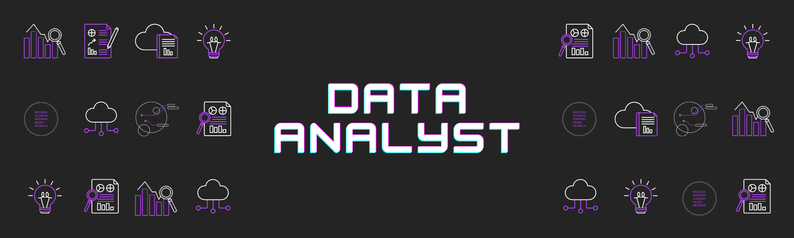

<h1 align="center">Hi 👋, I'm Jesús</h1>
<h3 align="center">A young data analyst in love with the Data world 💙</h3>

<ul align="left">
    <li>
        🌱 I’m currently learning <b>Python for Data Engineering and Data Science</b>
    </li>
    <li>
        👯 I’m looking to collaborate on <b>ETL, data visualization, and data report projects</b>
    </li>
    <li>
        👨‍💻 All of my projects are available at <a href="https://github.com/Jebushdd"> GitHub</a>
    </li>
    <li>
        📝 I regularly write articles on <a href="https://linkedin.com/in/martinezjesusfl"> LinkedIn</a>
    </li>
    <li>
        💬 Ask me about <b>ETL, Google Data Studio, BigQuery, Spreadsheets</b>
    </li>
    <li>
        📫 You can contact me at <b>martinez.jesusfl@gmail.com</b>
    </li>
    <li>
        📄 Know about my experiences <a href="https://linkedin.com/in/martinezjesusfl"> LinkedIn</a>
    </li>
    <li>
        ⚡ Fun fact <b>Memes, stickers & cats are my passion</b>
    </li>
</ul>

<h3 align="left">Connect with me:</h3>

<h3 align="left">Languages and Tools:</h3>
<ul align="left"> 
    <li> <b>Data Analysis:</b>
        <a href="https://www.google.com/sheets/about/" target="_blank" rel="noreferrer">
            
        
        
        
        
        
    </li>
     
    <li> <b>Web development:</b>
        
        
        
    </li>
</ul>

    

